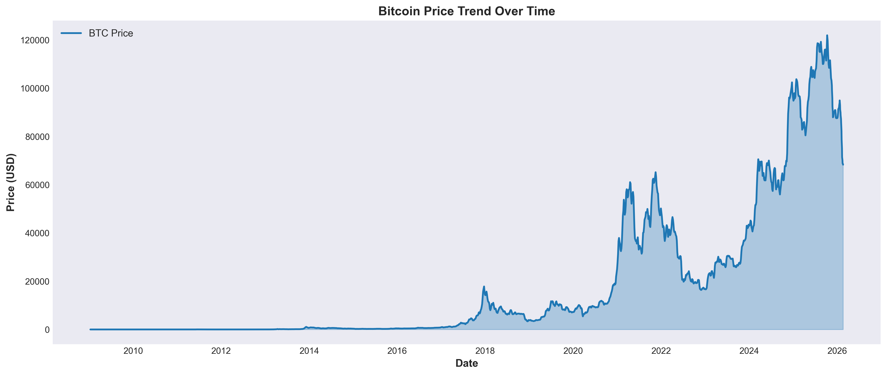

# Regression and Descriptive Analysis of Cryptocurrency Markets

**An Empirical Study of Blockchain Technology and Bitcoin (2010–2026)**

## Overview
This repository contains the source code, interactive data visualizations, and full complete empirical research paper for an exhaustive study on cryptocurrency markets. The project bridges the gap between theoretical econometrics and practical blockchain analytics, focusing primarily on Bitcoin's market behavior over a 16-year period.

### 🌐 Live Website: [View the Interactive Research Portfolio](https://baua5252-cloud.github.io/Crypto-research/)

## Key Research Components

### 1. Empirical Research Paper
- **Title:** Regression and Descriptive Analysis of Cryptocurrency Markets
- **Methodology:** OLS Regression, Time Series Analysis, Machine Learning
- **Core Focus:** Institutional adoption dynamics, network hash rate impact, and market regime transitions.
- **Data Points:** 5,000+ daily observations.

### 2. Interactive Website
Built from the ground up to present the research findings professionally:
- **Dark-Theme UI:** Sophisticated charcoal and amber UI designed for academic and quantitative data presentation.
- **Frontend Stack:** HTML5, CSS3, Vanilla JavaScript.
- **Animations:** Custom CSS keyframes, 3D tilt perspective cards, typing cursors, dynamic dataset charts.

### 3. Data Visualizations
The repository includes interactive charts examining:
- Historical Price Trends vs. Hash Rate
- Network Difficulty Progressions
- Market Regime Transitions (Pre-Institutional vs. Institutional Adoption)
- Rolling Correlations (Heatmaps and Scatter Matrices)
- Daily Returns and Volatility Distribution

## File Structure

- `/index.html` - The main structure of the interactive research presentation.
- `/style.css` - Custom styling, CSS variable architecture, premium animations.
- `/script.js` - Dynamic interactions, particle background generation, scroll reveals.
- `/*.png` - High-resolution data visualization outputs.
- `/*.json` - Cleaned macroeconomic and blockchain datasets.
- `/*.docx` - Final and Descriptive Econometric Research Papers.

## Key Findings Highlight

1. **Hash Rate Predictability:** Network hash rate demonstrates the strongest predictive power for long-term Bitcoin valuation (R² = 0.89).
2. **Volatility Reduction:** Institutional adoption post-2020 has demonstrably constrained historically characterized extreme volatility.
3. **Market Regimes:** The clustering analysis confirms two statistically distinct macroeconomic phases of adoption.

## About the Author

**Ravi Chaudhary**  
*Aspiring Quantitative Analyst*

Passionate about leveraging data science, statistics, and machine learning for financial market analysis, specifically focusing on the intersection of blockchain infrastructure and academic research.

- **LinkedIn:** [Ravi Chaudhary](https://www.linkedin.com/in/ravichaudhary10000)
- **GitHub:** [@baua5252-cloud](https://github.com/baua5252-cloud)

## License
&copy; 2025-2026 Ravi Chaudhary. All rights reserved.
